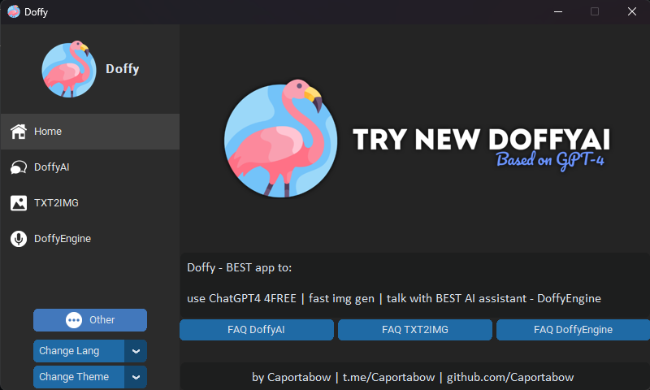

## Contents:
- ### [Description](https://github.com/Caportabow/Doffy#description)
- ### [Download](https://github.com/Caportabow/Doffy#download)
- ### [Credits](https://github.com/Caportabow/Doffy#credits)
## Download

## Description:
DoffyAI is a cutting-edge artificial intelligence software that utilizes the latest in machine learning and natural language processing to provide a unique and personalized experience for its users. Based on the GPT-4 architecture, DoffyAI is capable of generating high-quality text that is virtually indistinguishable from human writing. Its advanced algorithms also enable it to generate realistic and visually stunning images on demand, making it an ideal tool for artists and designers.
One of the standout features of DoffyAI is its intuitive and user-friendly interface. Designed with the end user in mind, DoffyAI's interface is streamlined and easy to use, allowing users to get the most out of its powerful features with minimal effort. Whether you're a seasoned professional or a novice user, DoffyAI's interface makes it easy to harness the power of artificial intelligence and unlock your creative potential.
In addition to its text and image generation capabilities, DoffyAI also features a Jarvis-like assistant that is always ready to assist you with your queries and tasks. This virtual assistant is designed to provide personalized assistance and support, helping you to get the most out of your DoffyAI experience.
And the best part? DoffyAI is available to use for free! So whether you're a student, artist, writer, or just someone who is curious about the power of artificial intelligence, DoffyAI is the perfect tool for you. With its advanced features and user-friendly interface, DoffyAI is sure to become an indispensable part of your creative toolkit.
### ToDo List:
- Add checking for updates every time the app is launched(✅ Completed in 0.75 | improved in 0.85)
- Add txt2img AI's(✅ Completed in 0.85)
- Integrate fast ChatGPT4 voice helper(like Jarvis from Iron Man movies)
- Make an option to save generated pic
- Make an option to type prompts with voice
- Make more animations in the UI
- Make linux and MACOSX versions
## [License](https://github.com/Caportabow/Doffy/blob/main/LICENSE.md)
## Support:

## Credits:
### [Main Developer](https://github.com/Caportabow)
### [Icons - Flaticon](https://www.flaticon.com/)
### Scripts:
- [customtkinter](https://github.com/TomSchimansky/CustomTkinter) by [@TomSchimansky](https://github.com/TomSchimansky)

- [CTkMessagebox](https://github.com/Akascape/CTkMessagebox) by [@Akascape](https://github.com/Akascape)